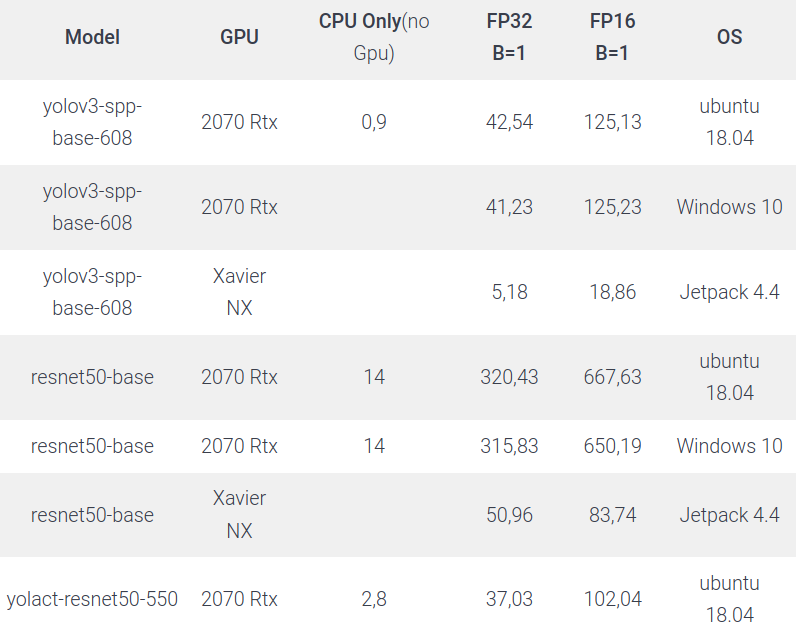
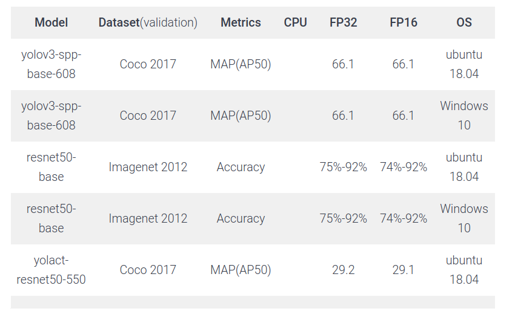

## Ai4prod 👋

**Ai4prod is the first ecosystem to make inferece in C++ simple**. 

Ai4prod lets you train your model in python and convert it to C++ while mantaining the same accuracy and speeding up the performance.

Ai4prod is working independently on **Windows, Linux, Nvidia Jetson**.

We developed ai4prod with the idea to simplify the entire pipeline in a machine learning project. As a machine learning engineer we know that make something work in an Ai project is not simple. 

ai4prod is built to be easily integrable in your production environment. Have a look at example folder.

We built ai4prod to help us to crete real value in a production environment, so we hope that could also help you.

Ai4prod is developed following our experience in production if you think that something is missing or could be helpfull drop us an email ai **info@ai4prod.ai**.

We are always open to collaboration.

## Getting Started

Ai4prod is built to be as easy as possible to get started.

1) Download this repository
2) Download dependencies of the project. You can find all dependencies here 
https://drive.google.com/drive/u/2/folders/1B4lXyGM2IQmj6IHFThwlJRqnMGQoTjNq
3) Build https://www.ai4prod.ai/docs/getting-started/
4) See our example folder

Note: some dependencies are not build yet. If you need send us an email to info@ai4prod.ai

To make things even easier you can find all information at our site www.ai4prod.ai

## Tutorial

### Classification

https://www.ai4prod.ai/docs/tutorial/resnet50/

### Object Detection

https://www.ai4prod.ai/docs/tutorial/yolov3/

## Results 

### Inference Time

### Accuracy

## Troubleshooting

If you encounter some problems you can open an issue on github or send us an email

## License

For use it in commercial solution please contatct us at info@ai4prod.ai

